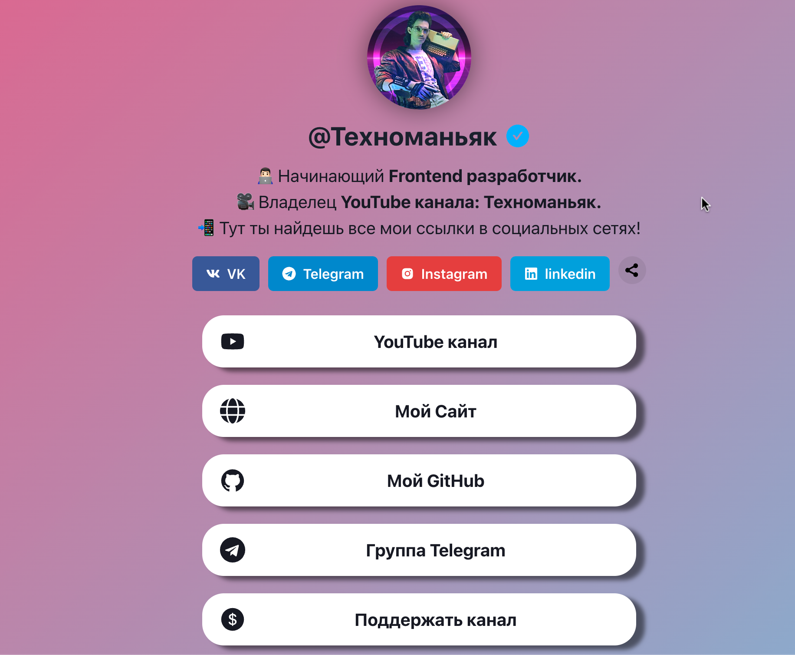

# Страница со всеми социальными сетями

Страница со всеми социальными сетями, является аналогом таких сервисов как: **linktr**, **milkshake**, **Taplink** и многих других.

## Технологии




https://youtu.be/l1lHN-G0kgg

Проект написан с использованием библиотеки компонентов для **React** - **Chakra UI**. [Ссылка на документацию Chakra UI.](https://chakra-ui.com/getting-started)

## Запуск проекта:
* Склонировать проект на ваш компьютер с Github с помощью команды:
```
git clone https://github.com/FilimonovAlexey/link-bio-page.git
```

* Установить зависимости с помощью команды:
```
npm install
```
* Запустить проект с помощью команды:
```
npm run start
```

## Настройка проекта

* Для отображения иконок в проекте используется библиотека **React Icons**. [Ссылка на документацию **React Icons**.](https://react-icons.github.io/react-icons)

* Анимации сделаны с использованием библиотеки: Motion. [Ссылка на документацию](https://www.framer.com/motion/introduction/)
